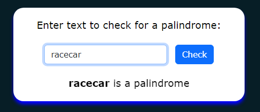
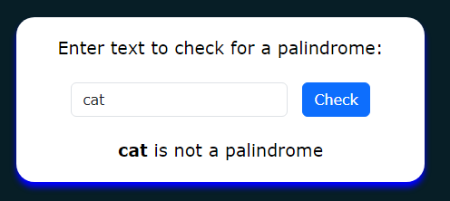

# Palindrome Checker Web Application

## Description
This is a simple web application that checks if a word entered by the user is a palindrome or not. A palindrome is a word, phrase, number, or other sequence of characters that reads the same forward and backward (ignoring spaces, punctuation, and capitalization).

## Technologies Used
- HTML
- CSS
- JavaScript

## How to Use
1. Clone the repository to your local machine:
   ```bash
   git clone https://github.com/samnpage/Palindrome_Checker.git

2. Navigate to the directory:
   ```bash
   cd Palindrome_Checker

3. Open `index.html` in a web browser.

4. Enter a word in the provided input field.

5. Click the "Check" button.

6. The application will display whether the word entered is a palindrome or not.

## Example
Input: racecar

Result: **racecar** is a palindrome.



Input: cat

Result: **cat** is not a palindrome.

